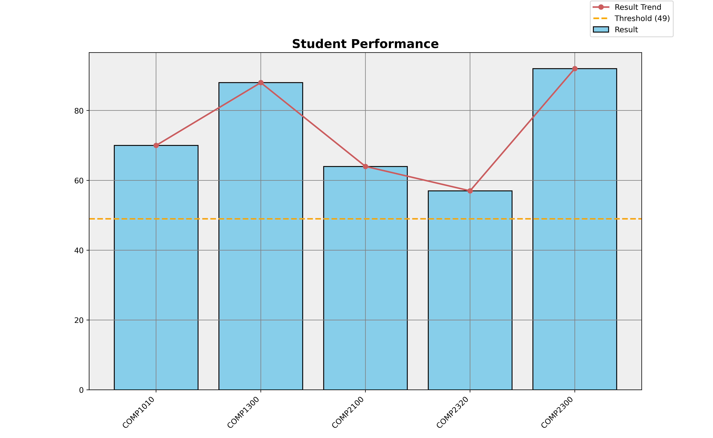
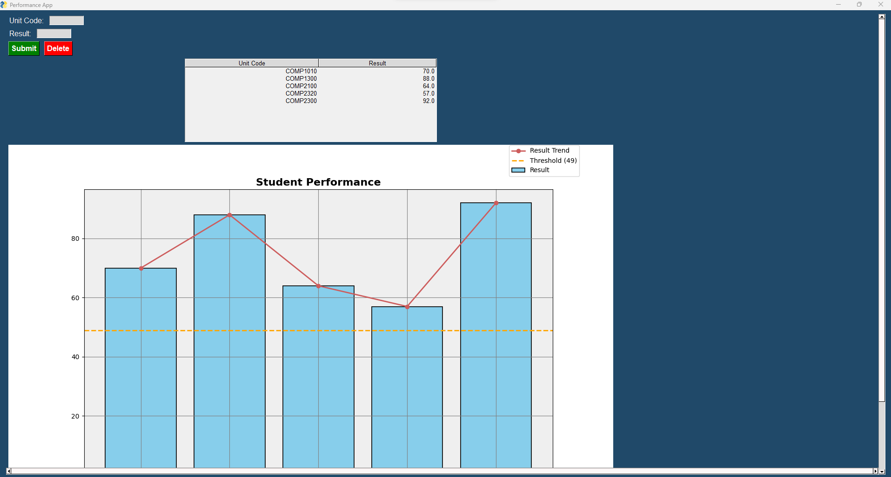
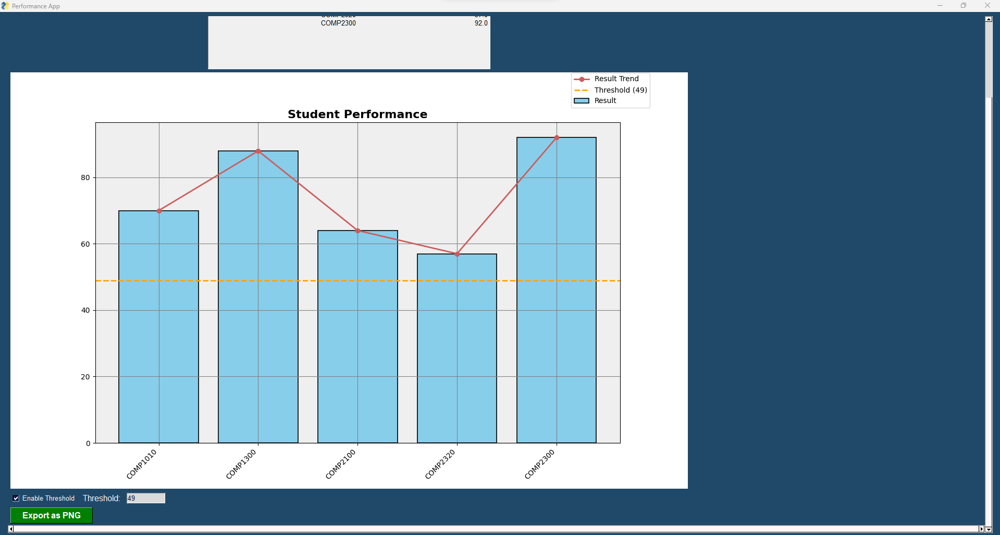

# Performance App

The Performance App is a Python program built using the PySimpleGUI library and matplotlib. It allows users to input unit codes and corresponding results, visualize the performance using bar and line charts, and export the graph as a PNG file.

## Features

- User-friendly interface with input fields for unit code and result, and buttons for submitting, deleting, and exporting to PNG.
- Interactive bar and line chart visualization of student performance based on the input data.
- Option to enable a threshold line on the chart to compare results against a predefined threshold value.
- Export the chart as a PNG file for sharing or further analysis.

## Screenshots








## Installation

1. Clone the repository:

   ```shell
   git clone https://github.com/your-username/performance-app.git

2. Install the required dependencies:

    ```shell
   pip install PySimpleGUI
   pip install matplotlib

## Usuage

1. Run the 'PerformanceApp.py' file:

    ```shell
    python PerformanceApp.py

**OR BY RUNNING THE 'performanceapp.exe' FILE THAT IS LOCATED WITHIN THE 'dist' FOLDER** 


2. Enter the unit code and result in the corresponding input fields.

3. Click the Submit button to add the data to the table and update the chart.

4. To delete a row, select it in the table and click the Delete button.

5. Enable the Enable Threshold checkbox and enter a threshold value in the Threshold input field to add a threshold line to the chart.

6. Adjust the chart as needed by resizing the window or scrolling horizontally.

7. Click the Export as PNG button to save the chart as a PNG file.


## Contributing

Contributions are welcome! If you encounter any issues or have suggestions for improvements, please feel free to open an issue or submit a pull request.